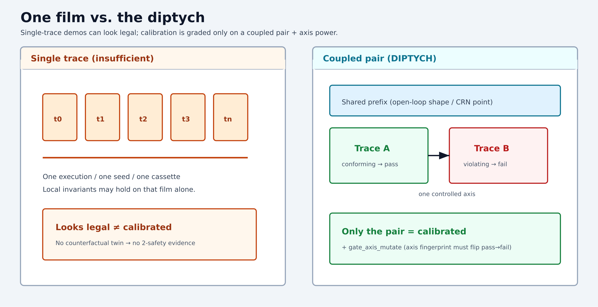
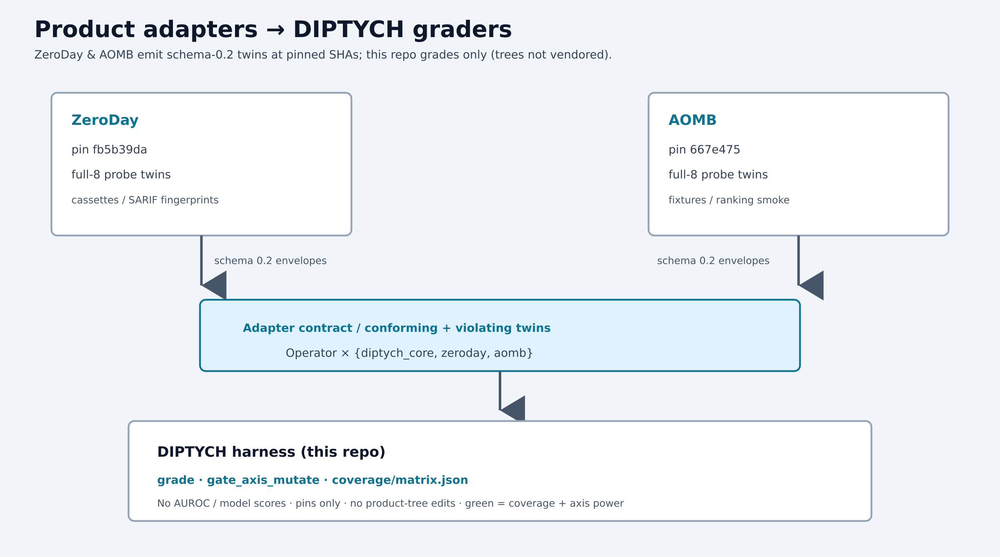

# DIPTYCH

[](https://github.com/pandeyaby/DIPTYCH/actions/workflows/ci.yml)

**DIPTYCH** grades calibration as **2-safety hyperproperties**: not one run, but a
coupled pair sharing all exogenous inputs except one controlled perturbation. It
forks a shared prefix (open-loop shape / CRN closed-loop point), discards
incomparable pairs, and probes suffixes only.

> One film = legal; only the pair = calibrated.

IEEE artifact harness. Schema `0.2`. Eight operators + `gate_axis_mutate`.





## Quick PoC (≈5 minutes, first clone)

**Need:** Git + **Python ≥ 3.10**. Core is stdlib-only (no `pip install` for the
gate). Optional: `pip install pytest` for CI-parity tests.

```bash
git clone https://github.com/pandeyaby/DIPTYCH.git
cd DIPTYCH
./scripts/run_poc.sh
# or: make poc
```

**Success = exit 0** and a printed **green×8×3** matrix: every operator’s
`diptych_core` / `zeroday` / `aomb` cells are `green` with `axis_power=true`,
plus `MATRIX CHECK OK` against [`examples/poc/expected_matrix_snippet.json`](examples/poc/expected_matrix_snippet.json).
Also: `GATE PASS` and unit tests `OK`.

```
SIGNFLIP     green    green    green    True
TRAJSWAP     green    green    green    True
… (eight operators) …
MATRIX CHECK OK (green×8×3; axis_power=true; matches examples/poc snippet)
PoC OK
```

Details: [`examples/poc/`](examples/poc/). Refresh/print only: `make matrix`.

**green×8×3 does not claim** accuracy, AUROC, model quality, or vulnerability
finding — only harness coverage + `gate_axis_mutate` axis power at the adapter
pins below.

## Paper

Living IEEEtran conference source (authors: Abhinav Pandey, Abhishek Pandey / Meta):

- **[`paper/one-trace-is-not-enough.tex`](paper/one-trace-is-not-enough.tex)** — authoritative IEEEtran source (§VII = evaluation **protocol**; ZeroDay@`fb5b39da` / AOMB@`667e475`; Table `tab:coverage` = live green×8×3; no invented scores)
- [`paper/SUBMISSION.md`](paper/SUBMISSION.md) — camera-ready / artifact zip package (venue TBD; corresponding author Abhinav)
- [`paper/ARTIFACT_CHECKLIST.md`](paper/ARTIFACT_CHECKLIST.md) — IEEE artifact checklist (code, controls, logs, non-claims, reproduce, CI PDF download)
- [`paper/README.md`](paper/README.md) — compile notes (`make paper` / CI `paper-pdf` fallback) + figure paths
- [`drafts/ieee-draft.md`](drafts/ieee-draft.md) — markdown prose draft (must not contradict `.tex`)
- [`PAPER_OUTLINE.md`](PAPER_OUTLINE.md) — thesis / section plan

Figures: PNGs referenced in README/tex; editable SVG sources alongside under
[`docs/images/`](docs/images/).

## Why no AUROC

AUROC (and lab AUROC / model grades) are **single-trace ranking scores**. DIPTYCH grades a **2-safety** claim over a *coupled pair*: twin contrast + `gate_axis_mutate` power-on-axis. Publishing AUROC as a hyperproperty grade would:

1. Collapse a relational property into a unary model metric
2. Invite cosmetic score fields that fail the axis gate (contract rejects `auroc` / `model_grade`)
3. Confuse localization with exploitability or model quality

Coverage cells record categorical green/pending status and boolean `axis_power` only — never invented model scores. See paper §VII (evaluation protocol).

## Operators

| Wave | Operators | Coupling |
|------|-----------|----------|
| A | FREEZEDRY, RESEED, SCHEMAX | open_loop |
| B | SIGNFLIP, SATEXTEND, HISTSWAP | open_loop |
| C | TRAJSWAP, VARSCALE | **crn_closed_loop** |

Specs: [`docs/OPERATORS.md`](docs/OPERATORS.md) · [`docs/adapters/`](docs/adapters/)

## Adapter pins

Product emitters are **not** vendored here. Pin and grade:

| Adapter | Short SHA | Full |
|---------|-----------|------|
| **ZeroDay** | `fb5b39da` | `fb5b39daf88e37521aaee8526ae9d286cf74f341` |
| **AOMB** | `667e475` | `667e47538ae5b9c504187b7a73220d22aa8fb96f` |

Details: [`adapters/PINS.md`](adapters/PINS.md).

## Layout

```
paper/             # living IEEEtran + SUBMISSION / RQ_PROTOCOL / ANON
diptych/           # core package (contract, grade, gates, axis mutate)
ops/<op>/          # spec.yaml + operator.py
controls/<op>/     # conforming.py + violating.py
diptych-probes/    # full-8 fixture twins (source=diptych_core)
coverage/matrix.json
docs/images/       # diptych-vs-single-trace + stack (PNG + SVG)
docs/adapters/     # CONTRACT, GATING, OPERATOR_TABLE, ONEPAGER, zeroday, aomb
examples/poc/
scripts/run_poc.sh
scripts/pack_artifact.sh   # make artifact → dist/DIPTYCH-<sha>.zip
Makefile           # poc | test | matrix | paper | artifact
PAPER_OUTLINE.md
drafts/ieee-draft.md
.github/workflows/ci.yml
```

## Non-claims

- No AUROC / model-score fields in graded envelopes
- No exploit / PoC payloads
- Localization ≠ exploitability
- `inconclusive` ≠ green
- green×8×3 = coverage / axis power only (not vuln-finding or accuracy)

## License

See [`LICENSE`](LICENSE) (MIT).
