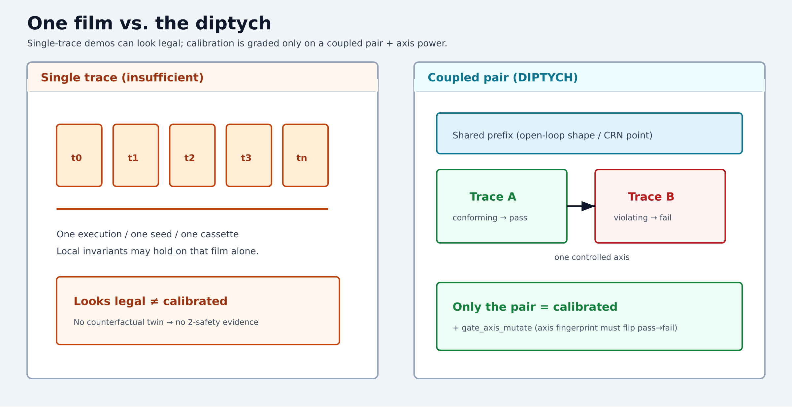
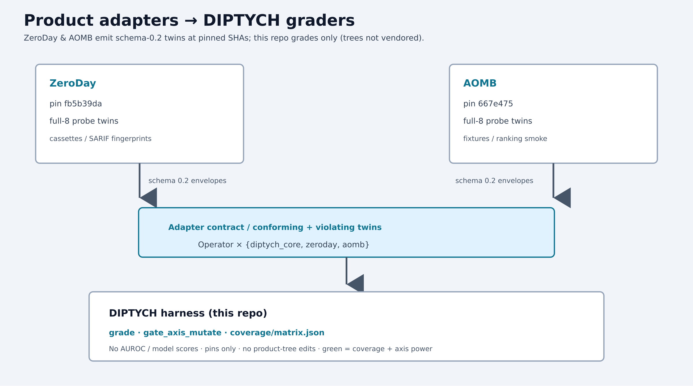

# DIPTYCH

[](https://github.com/pandeyaby/DIPTYCH/actions/workflows/ci.yml)

**Some requirements can't be checked by watching one run.** "React more strongly
to overload than to underload", "be more conservative when load is noisier",
"weigh recent evidence more than old" — each compares how a system *would*
behave in two related situations. A benchmark that grades one execution trace
cannot see these, so it silently passes code that violates them.

**DIPTYCH** grades such requirements on a **pair** of executions: run a shared
prefix once, fork the system, change exactly one thing (the sign of an error,
the order of recent observations, the noise level), and compare the two
branches. Formally, these requirements are 2-safety hyperproperties.

It is aimed at people who build benchmarks or graders for agent- and
model-written software, especially controllers and other stateful code.

**What we found** (paper §VIII): an exhaustive mutation sweep exposed three
real bugs in our own graders. In a pilot with 80 controllers written by Claude
and OpenAI models on two tasks, the answer depends on where the reference
comes from:

- On a concurrency task whose requirements compare a controller with itself
  from the same state, **28 of the 34 controllers that pass every single-trace
  check violate a stated requirement** once tested in pairs.
- On a congestion task built from the IETF's RFC 9743, one run catches every
  case of harm to a standard flow (the reference is a known constant), and
  pairing adds only the history-dependent violations.

Pair when the reference depends on the artifact's own state.

> One film can look legal; only the pair shows calibration.

Artifact for the paper *One Trace Is Not Enough* (targeting AGENT'27 @ ICSE
2027). Envelope schema `0.2`, eight perturbation operators, `gate_axis_mutate`
power check, and a runnable pilot in [`diptych/pilot/`](diptych/pilot/).





## Quick PoC (≈5 minutes, first clone)

**Need:** Git + **Python ≥ 3.10**. Core is stdlib-only. Optional editable install
exposes console scripts (`diptych`, `diptych-poc`, …); `pip install -e ".[dev]"`
also pulls pytest for CI-parity tests.

```bash
git clone https://github.com/pandeyaby/DIPTYCH.git
cd DIPTYCH
pip install -e ".[dev]"    # console scripts + pytest
diptych                    # unified smoke (schema → pins → grade → matrix → poc → thin)
# or: diptych smoke
# or: python -m diptych / make smoke
./scripts/run_poc.sh       # classic full-8 PoC + unit tests
# or: make poc
```

**Success = exit 0** and a printed **green×8×3** matrix: every operator’s
`diptych_core` / `zeroday` / `aomb` cells are `green` with `axis_power=true`,
plus `MATRIX CHECK OK` against [`examples/poc/expected_matrix_snippet.json`](examples/poc/expected_matrix_snippet.json).
Also: `GATE PASS` and unit tests `OK`.

```
SIGNFLIP     green    green    green    True
TRAJSWAP     green    green    green    True
… (eight operators) …
MATRIX CHECK OK (green×8×3; axis_power=true; matches examples/poc snippet)
PoC OK
```

Details: [`examples/poc/`](examples/poc/). Unified smoke: `diptych` / `diptych smoke` / `python -m diptych` / `make smoke` (optional `--json`). Console scripts after `pip install -e .`: `diptych-poc`, `diptych-grade`, `diptych-matrix`, `diptych-schema`, `diptych-full8` (same as `python -m diptych.*`). Refresh/print only: `make matrix`. Fixture→`diptych_core` matrix loop: `diptych-matrix --check` (or `make refresh-matrix` to rewrite core cells from cassette/probes; zeroday/aomb columns stay pin-documented). Adapter grade path: `diptych-grade --input <probe|dir>` (JSON default; `--sarif` / `--format sarif` for SARIF 2.1.0). Executable CONTRACT schema: `diptych-schema --check <probe|dir>` ([`docs/adapters/diptych_schema_0.2.json`](docs/adapters/diptych_schema_0.2.json)).

**green×8×3 does not claim** accuracy, AUROC, model quality, or vulnerability
finding — only harness coverage + `gate_axis_mutate` axis power at the adapter
pins below.

## Cite

```bibtex
@misc{diptych2026,
  title        = {One Trace Is Not Enough: Hyperproperty Grading for
                  Agent-Authored Control Systems},
  author       = {Pandey, Abhinav and Pandey, Abhishek},
  year         = {2026},
  howpublished = {\url{https://github.com/pandeyaby/DIPTYCH}},
  note         = {IEEE conference submission draft; no DOI yet}
}
```

Machine-readable: [`CITATION.cff`](CITATION.cff) (no DOI yet).

## Paper

IEEEtran conference source (Abhinav Pandey, Independent Researcher; Abhishek
Pandey, Meta):

- **[`paper/one-trace-is-not-enough.tex`](paper/one-trace-is-not-enough.tex)** — the paper; PDF from `make paper` or the CI artifact `one-trace-is-not-enough-pdf`
- [`paper/READINESS.md`](paper/READINESS.md) — submission status and pre-upload checklist
- [`paper/SUBMISSION.md`](paper/SUBMISSION.md) — venue (AGENT'27), page budget, artifact zip
- [`paper/RQ_PROTOCOL.md`](paper/RQ_PROTOCOL.md) — research questions and the pilot results ledger
- [`paper/ARTIFACT_CHECKLIST.md`](paper/ARTIFACT_CHECKLIST.md) — reviewer reproduction checklist
- [`CHANGELOG.md`](CHANGELOG.md) — milestone log

Reproduce the evaluation (no model calls): `python -m diptych.adequacy`,
`python -m diptych.pilot.study`, `python -m diptych.pilot.study --task congestion`.

Figures: PNGs referenced in README/tex; editable SVG sources alongside under
[`docs/images/`](docs/images/).

## Why no AUROC

AUROC (and lab AUROC / model grades) are **single-trace ranking scores**. DIPTYCH grades a **2-safety** claim over a *coupled pair*: twin contrast + `gate_axis_mutate` power-on-axis. Publishing AUROC as a hyperproperty grade would:

1. Collapse a relational property into a unary model metric
2. Invite cosmetic score fields that fail the axis gate (contract rejects `auroc` / `model_grade`)
3. Confuse localization with exploitability or model quality

Coverage cells record categorical green/pending status and boolean `axis_power` only, never model scores. See paper §VIII.

## Operators

| Wave | Operators | Coupling |
|------|-----------|----------|
| A | FREEZEDRY, RESEED, SCHEMAX | open_loop |
| B | SIGNFLIP, SATEXTEND, HISTSWAP | open_loop |
| C | TRAJSWAP, VARSCALE | **crn_closed_loop** |

Specs: [`docs/OPERATORS.md`](docs/OPERATORS.md) · [`docs/adapters/`](docs/adapters/)

## Adapter pins

Product emitters are **not** vendored here. Pin and grade:

| Adapter | Short SHA | Full |
|---------|-----------|------|
| **ZeroDay** | `fb5b39da` | `fb5b39daf88e37521aaee8526ae9d286cf74f341` |
| **AOMB** | `667e475` | `667e47538ae5b9c504187b7a73220d22aa8fb96f` |

Pins change only when the coverage matrix requires it. Details: [`adapters/PINS.md`](adapters/PINS.md).

## Layout

```
paper/             # IEEEtran source + READINESS / SUBMISSION / RQ_PROTOCOL / ANON
diptych/pilot/     # pilot study: task, plant, controls, generated controllers, study
CHANGELOG.md       # milestone log
LICENSE            # MIT (also cited below)
CITATION.cff       # cite metadata (pandeyaby/DIPTYCH; no DOI)
diptych/           # core package (contract, grade, gates, axis mutate)
ops/<op>/          # spec.yaml + operator.py
controls/<op>/     # conforming.py + violating.py
diptych-probes/    # full-8 fixture twins (source=diptych_core)
coverage/matrix.json
docs/images/       # diptych-vs-single-trace + stack (PNG + SVG)
docs/adapters/     # CONTRACT, GATING, OPERATOR_TABLE, ONEPAGER, zeroday, aomb
examples/poc/
scripts/run_poc.sh
scripts/pack_artifact.sh   # make artifact → dist/DIPTYCH-<sha>.zip
Makefile           # smoke | poc | test | matrix | paper | artifact
PAPER_OUTLINE.md
drafts/ieee-draft.md
.github/workflows/ci.yml
```

## Non-claims

- No AUROC / model-score fields in graded envelopes
- No exploit / PoC payloads
- Localization ≠ exploitability
- `inconclusive` ≠ green
- green×8×3 = coverage / axis power only (not vuln-finding or accuracy)

## License

MIT — see root [`LICENSE`](LICENSE). Bundled in `make artifact` zip and cited
from [`paper/SUBMISSION.md`](paper/SUBMISSION.md) / [`paper/READINESS.md`](paper/READINESS.md).
